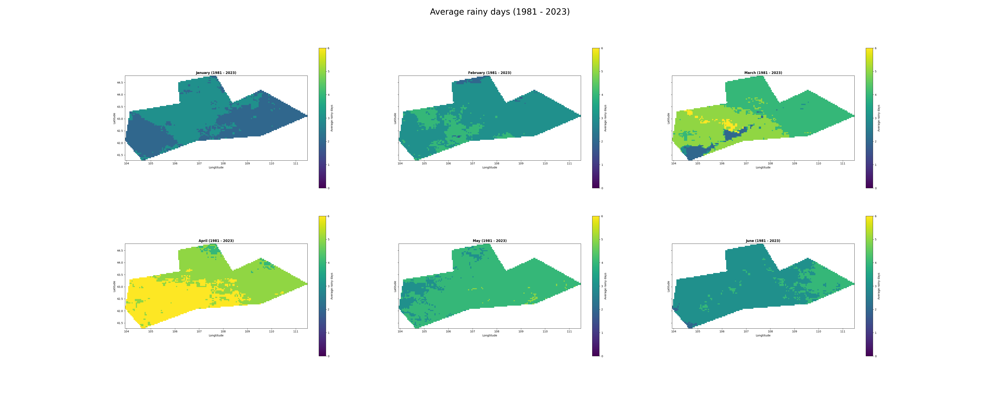
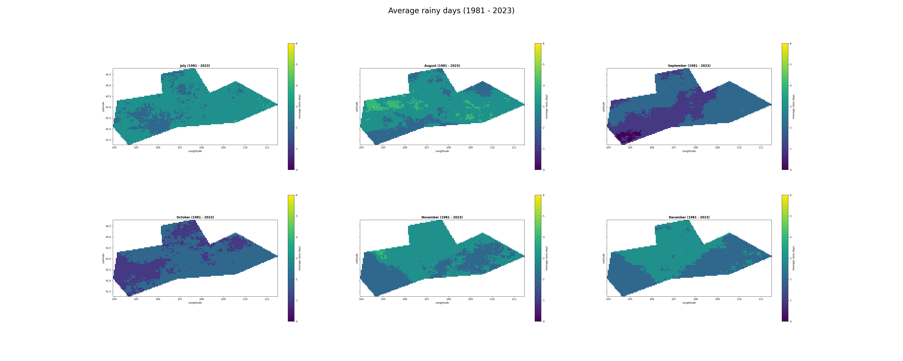

### Create rasters of mean monthly rainy days from CHIRPS data with Google Earth Engine GEE

[[Google Colab](
https://colab.research.google.com/github/linh-ktran/technical-test-it4r/blob/main/Avg_rainy_days_rasters.ipynb)]

### I. Environment settings

Install pycrs and update package manager to install earthengine-api:
```
pip install earthengine-api --upgrade
pip install pycrs
```
#### Python setup:
You need to authenticate to use the Earth Engine Python and initialize it with a project that you own. This project will be used for running all Earth Engine operations.
```python
import ee
ee.Authenticate()
ee.Initialize(project='ee-linhha53')
```
#### To display the results
```
pip install rasterio
```

### II. Using Google Earth Engine

- `Objective`: The average number of rainy days per month for the area of interest
- `Dataset`:  [CHIRPS DAILY](https://www.chc.ucsb.edu/data/chirps) The daily rain data 
- `Tool`: Using [Google Earth Engine](https://developers.google.com/earth-engine)  through Python API.

1. Create a ImageCollection with CHIRPS daily precipitation data.
```python
# Define start and end years, dates (1981 - 2023)
start_year = 1981
end_year = 2023
start_date = ee.Date.fromYMD(start_year, 1, 1)
end_date = ee.Date.fromYMD(end_year, 12, 31)

# Initialize the library.
chirps = ee.ImageCollection('UCSB-CHG/CHIRPS/DAILY')
           .filterDate(start_date, end_date)
```

2. Create a binary mask for rainy days.

Rainy day: precipitation > 0 mm/day. threshold=0
```python
def create_rainy_mask(image, threshold=0):
    """Function to create a binary rainy day mask. """
    rainy_mask = image.select(['precipitation']).gt(threshold)
    return image.addBands(rainy_mask.rename('rainy_mask'))

# Map the function over the ImageCollection
rainy_mask = chirps.map(create_rainy_mask).select('rainy_mask')
```

3. Calculate the sum of rainy days for a given month in a given year

Create `years` and `months` sequences:
```python
# Create an ee.List object with a sequence of integer numbers between a start year and an end year
years = ee.List.sequence(start_year, end_year)
# Create an ee.List object with a sequence of integer numbers between 1 and 12 (months)
months = ee.List.sequence(1, 12)
```

```python
def yearly_monthly_sum(year):
    """Function to map the monthly_sum() to every month in the months sequences."""
    def monthly_sum(month):
        """Function to calculate the sum of rainy days for a given month in a given year."""
        w = rainy_mask.filter(ee.Filter.calendarRange(year, year, 'year')) \
                      .filter(ee.Filter.calendarRange(month, month, 'month')) \
                      .sum()
        return w.set('year', year) \
                .set('month', month) \
                .set('system:time_start', ee.Date.fromYMD(year, month, 1))
    return months.map(monthly_sum)
```
```python
# Map the yearly_monthly_sum() function to every year in the years sequence to get an ImageCollection with total rainy days in each month in each year
monthly_rainy_days = ee.ImageCollection.fromImages(
    years.map(yearly_monthly_sum).flatten()
)
```

4. Calculate the average rainy days for a given month across all years
```python
def monthly_mean(month):
    """Function to calculate the average rainy days for a given month across all years."""
    # Round to the nearest integer.
    w = monthly_rainy_days.filter(ee.Filter.eq('month', month)).mean().round()
    return w.set('month', month) \
            .set('system:time_start', ee.Date.fromYMD(1, month, 1))

# Map the monthly_mean() function to every month in the months sequence and make an ImageCollection from the obtained images
mean_monthly_rainy_days = ee.ImageCollection.fromImages(
    months.map(monthly_mean).flatten()
)
```

5. Clip to the area of interest

```python
# Add the area of interest
aoi = geemap.shp_to_ee("/content/drive/MyDrive/ENAC-IT4R Technical Test/data/aoi.shp")

def clip_image_collection(image):
    """Function to clip each image to the area of interest shapefile."""
    return image.clip(aoi)

# Map the clip_image_collection() function to the mean_monthly_rainy_days collection 
mean_monthly_rainy_days_clipped = mean_monthly_rainy_days.map(clip_image_collection)
```

### III. Display the results

1. Interactive map:
- The geemap library can be used to display ee.Image objects on an interactive ipyleaflet map.
2. Visualizing results:
- Export the raster image to Drive in format Tif File
- Visualizing Tif File Using Matplotlib and GDAL



